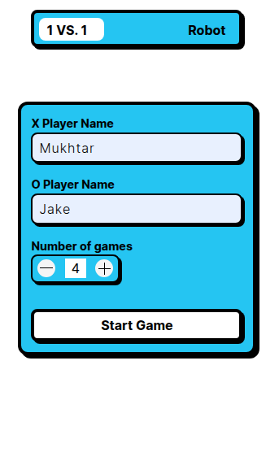

# 🧠 Tic-Tac-Toe Game

A feature-rich, DOM-driven **Tic-Tac-Toe** game built with vanilla JavaScript. 

Play against a human or challenge a simple yet powerful AI that uses the Minimax algorithm for optimal gameplay. The game supports multiple rounds, keeps scores, and provides dynamic UI updates.

---

## Concepts Learned and practiced

* The Module Pattern: Immediately Invoked function execution (IIFEs)
* Factory Functions
* Advanced DOM Manipulations
* Named Parameters in JS using object destructuring
* Closures
* Encapsulation with the module pattern
* Prototypal Inheritance using factories

## ✨ Features

* 🧑‍🤝‍🧑 **Player vs Player** and 🤖 **Player vs AI** modes
* 🔁 Multiple game rounds with scoreboard
* 🧮 AI powered by Minimax algorithm
* 🧼 Reset and next round functionality
* 📊 Real-time score and draw tracking
* 💬 AI "thinking" UI feedback
* 🧠 Intelligent move calculations based on board state
* 🎨 Fully interactive DOM-based UI

---
## 📸 Screenshots

### First Screen

### 🧑‍🤝‍🧑 Player vs Player Mode


### 🤖 Player vs AI Mode


### 🏆 Game Over Dialog


### 📊 Scoreboard UI


---

## 🧩 Architecture Overview

### `gameBoard`

Handles game state and board logic.

* Stores board as 1D array of 9 cells
* Validates winning conditions
* Tracks filled cells and available positions
* Allows mark placement and board reset

### `createHumanPlayer(name, mark)`

Factory function for creating human players.

* Can place marks
* Manages turns and score
* Tracks player identity

### `createRobot()`

Factory function for creating an AI player.

* Plays using:

  * `playAtBestPosition()` (Minimax)
  * `playAtRandomPosition()` (fallback)
* Tracks its own score and turn

### `aiMethods`

Encapsulates Minimax logic.


### `gameController(player1, player2, numberOfGames)`

Controls game flow.

* Alternates turns
* Validates and checks for winner
* Handles scoring and announcing match result

### `domManipulations`

Manages all DOM updates.

* Places marks on UI
* Updates scores and round messages
* Toggles game states and buttons
* Animates AI thoughts and displays dialogs

---

## 🕹️ How to Play

1. Choose your game mode: vs Human or vs AI
2. Enter your name(s) and number of rounds
3. Start the game and take turns clicking the board cells
4. View live scores and round outcomes
5. Use "Clear" to reset the board, "Next Round" to proceed
6. Final results are displayed after all rounds

---

## 🚀 Setup

1. Clone or download the repository.
2. Open the `index.html` file in your browser.
3. Enjoy the game!

---

## 📂 Project Structure

```bash
.
├── index.html
├── styles.css
└── script.js
```

> ⚠️ All JavaScript logic is currently in a single `script.js` file for simplicity.

---

## 🧠 AI Logic Summary

This AI uses a **Minimax algorithm** for decision-making:

* Evaluates all possible future board states
* Selects the move that maximizes win probability
* Plays optimally and never loses (unless forced into a draw)

---

## 📌 To-Do / Improvements

* Add difficulty levels for AI
* Add sound and animations
* Modularize JS into separate files (ES6 modules)
* Responsive mobile support

---

## 🪪 License

MIT License


